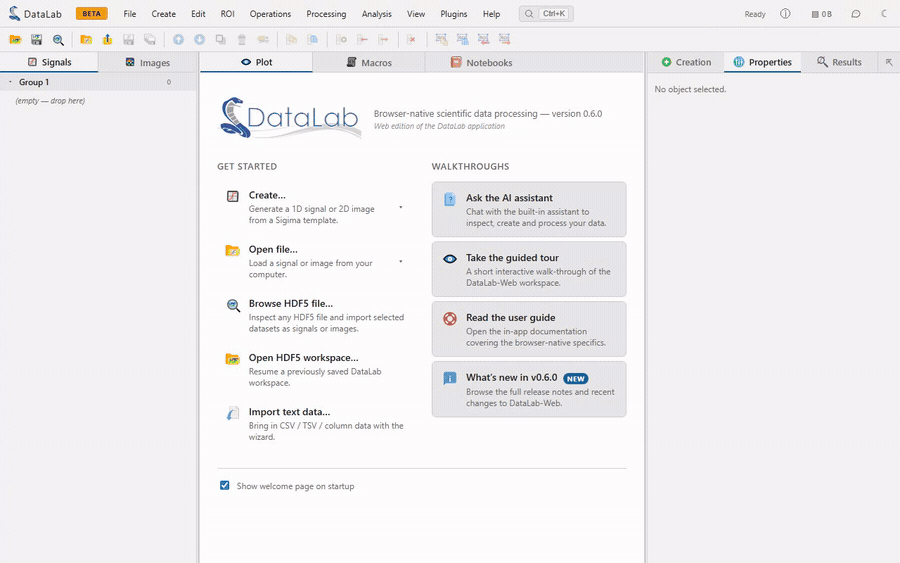
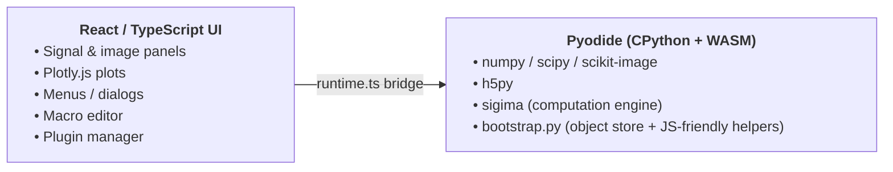

# DataLab Web

Full-Web reimplementation of the [DataLab](https://datalab-platform.com/) scientific data-processing platform — the entire computation engine and processing catalog run **inside the browser**.

DataLab Web embeds the [Sigima](https://github.com/DataLab-Platform/Sigima) computation engine in [Pyodide](https://pyodide.org/) (CPython compiled to WebAssembly, JupyterLite-style) and pairs it with a dedicated React / TypeScript user interface modelled on the desktop Qt DataLab application. Plotting is delegated to [Plotly.js](https://plotly.com/javascript/) since Qt-based PlotPy is not available in the browser.

## 🚀 Try it now — no install required

**👉 <https://datalab-platform.com/web/>**

The latest release is deployed automatically to GitHub Pages. Open the link in any modern browser (Chrome, Edge, Firefox, Safari) and the full DataLab application — Sigima, NumPy, SciPy, scikit-image, h5py — runs locally inside the browser tab. No server, no account, no upload: your data never leaves your machine.

> First load downloads Pyodide and installs Sigima via `micropip` (~30–60 s). Subsequent loads are cached by the browser.

> **Microsoft Edge users:** if the first load takes several minutes instead of ~30 s, Edge's _Enhance your security on the web_ setting is disabling the WebAssembly JIT compiler on this site. Microsoft [documents this behaviour and explicitly recommends the workaround](https://learn.microsoft.com/en-us/deployedge/microsoft-edge-security-browse-safer) — quoting the page:
>
> > Developers should be aware that the WebAssembly (WASM) interpreter running in enhanced security mode might not yield the expected level of performance. We recommend adding your site as an exception to opt-out of enhanced security mode for site users.
>
> To add the exception: open `edge://settings/privacy` → _Security_ → _Manage enhanced security for sites_ → under _Never use enhanced security for these sites_, click _Add a site_ and enter `https://datalab-platform.com` (or your deployment URL). Reload the page; load time drops back to ~30 s. Chrome, Firefox and Safari are not affected.



## Features

DataLab Web mirrors a large portion of the desktop application surface:

- **Signal panel** — 1D curves with synthetic generators (Gaussian, Lorentzian, Voigt, Planck blackbody, sine, sawtooth, triangle, square, sinc, chirp, step, exponential, logistic, pulses, polynomial, custom expressions, noise distributions…) and full Plotly visualisation with cross-hair markers and annotations.
- **Image panel** — 2D arrays with synthetic generators (2D Gaussian, ramp, checkerboard, sinusoidal grating, ring pattern, Siemens star, 2D sinc, uniform / normal / Poisson noise…), zoomable Plotly heatmap, contrast adjustment, cross profiles and stats area tools.
- **Processing** — operations, transforms, filters, fitting, FFT/PSD, stability analyses and many other Sigima 1-to-1 / 2-to-1 / n-to-1 processings, exposed automatically through the menu bar by introspecting Sigima's catalog.
- **Analysis** — measurements producing scalar results and result tables; interactive fit dialog; profile extraction (line / segment / average / radial) with graphical parameter editing.
- **ROI management** — segment / rectangular / circular / polygonal regions of interest with a dedicated editor and grid view.
- **Object tree** — multi-group workspace with drag & drop, properties, metadata editor, statistics card and computation history.
- **Macros** — embedded Python editor (CodeMirror with autocompletion and search) plus a console, mirroring DataLab's macro system. Macros run in a dedicated Web Worker (their own Pyodide instance) and call an async `proxy` API that mirrors DataLab's `RemoteProxy`.
- **Notebooks** — multi-tab notebook panel with code & markdown cells, persistent in-browser autosave (IndexedDB), full nbformat v4.5 `.ipynb` import / export, three bundled templates (Quickstart, Signal & image processing, Proxy methods) and bidirectional **Convert to macro** / **Convert to notebook** actions (Spyder-style `# %%` / `# %% [markdown]` separators). See [doc/notebooks.md](doc/notebooks.md).
- **Plugins** — Qt-compatible `PluginBase` API. The same plugin source runs in DataLab desktop and DataLab Web provided dialogs use `await param.edit_async(...)`. See [doc/plugins.md](doc/plugins.md).
- **I/O** — HDF5 browser (via `h5py` running in Pyodide), text import wizard and per-directory save dialog.
- **UI niceties** — light / dark theme, resizable splitters with persisted layout, pop-out result panel, contextual help dialog.

## Architecture overview

> For the full picture — layer view, component view, worker protocols and
> end-to-end flows with diagrams — see [doc/architecture.md](doc/architecture.md).



Top-level source layout:

- `src/runtime/` — Pyodide loader, typed TS runtime, React contexts,
  Python kernel modules (`bootstrap.py`, `processor.py`, `dlw_*.py`),
  macro / notebook Web Workers and the proxy / remote bridges.
- `src/components/` — UI building blocks (menu bar, object tree, plots,
  dialogs, macro / notebook panels…). Parameter dialogs are auto-generated
  from guidata DataSet schemas by `DataSetDialog.tsx`.
- `src/actions/` — action registry mapping Sigima features to menu items.
- `src/macros/`, `src/notebook/`, `src/plugins/`, `src/aiassistant/`,
  `src/preferences/`, `src/storage/`, `src/utils/` — focused subsystems.
- `src/App.tsx` — top-level layout with persisted splitters.
- `packages/sdk/` — host-side TypeScript SDK
  (`@datalab-platform/web-sdk`) shipped as a separate tarball; its
  `package.json` version must stay in sync with the app.

## Persistence model

DataLab-Web treats the **HDF5 workspace file as the single durable
source of truth**. Everything else — IndexedDB caches, the recent
notebooks/macros menus, even the in-memory Python object model — is
ephemeral and reset on a hard reload of the Pyodide instance.

| Asset class                               | Survives F5 reload?              | How to make durable                                                              |
| ----------------------------------------- | -------------------------------- | -------------------------------------------------------------------------------- |
| Signals & images                          | **No** — wiped with Pyodide      | **File → Save HDF5 workspace…**                                                  |
| Groups, ROIs, metadata, plot annotations  | **No** — wiped with Pyodide      | **File → Save HDF5 workspace…**                                                  |
| Macro **content**                         | Yes — IndexedDB _recovery cache_ | **File → Save HDF5 workspace…** for the full workspace, or download individually |
| Notebook **content**                      | Yes — IndexedDB _recovery cache_ | **File → Save HDF5 workspace…**, or **Save notebook as…** for a `.ipynb`         |
| Notebook **outputs / execution counters** | **No** — outputs aren't cached   | Save HDF5 workspace (outputs are persisted there too)                            |

How this surfaces in the UI:

- The window title shows `DataLab-Web — <filename or "Untitled">`,
  with a `•` marker as soon as the workspace contains unsaved
  changes. A `(recovered)` hint is added when the macros / notebooks
  panels rehydrated from the IndexedDB cache; both clear on the next
  **Open / Save HDF5 workspace…**.
- A `beforeunload` confirmation prompt fires only when the workspace
  is dirty.
- A one-time recovery banner appears at cold start if the IndexedDB
  cache reseeded macros or notebooks, reminding you that the
  workspace is not yet durable. **Dismiss** hides the banner;
  **Save HDF5 workspace…** promotes the recovered state to a real
  file.
- Fresh sessions are labelled **Untitled**. The first
  **File → Save HDF5 workspace…** proposes a timestamped name
  (`workspace-YYYYMMDD-HHMMSS.h5`); subsequent saves reuse the last
  filename associated with the session.

The behaviour mirrors DataLab desktop: closing without saving loses
unsaved work; opening an HDF5 workspace replaces the in-memory state.

## Comparison with related projects

| Project         | Purpose                                             | Runs where      |
| --------------- | --------------------------------------------------- | --------------- |
| DataLab         | Reference desktop app (Qt + PlotPy)                 | Native          |
| DataLab-Kernel  | Jupyter kernel exposing DataLab to notebooks        | Local Python    |
| **DataLab-Web** | **Full browser app, Sigima in WASM (this project)** | **Browser**     |
| Sigima          | Headless computation engine (signals/images)        | Anywhere Python |

## Development

Prerequisites: Node.js ≥ 18.

```powershell
npm install
npm run dev
```

Open <http://localhost:5173>. The first load downloads Pyodide (~10 MB) and installs Sigima via `micropip`, which can take 30–60 seconds. Subsequent loads are cached by the browser.

### Build a static deployment

```powershell
npm run build
```

The `dist/` folder can be served from any static host (GitHub Pages, S3, nginx, …). Vite is configured with `base: "./"` so all paths are relative and the app works under sub-paths.

### Useful scripts

```powershell
npm run lint     # ESLint
npm run format   # Prettier
npm run preview  # Serve the production build locally
```

### Releasing a new version

The application version is declared **once**, in `package.json`, and is injected into the bundle at build time via Vite's `define` option (see `vite.config.ts`). The _Help → About_ dialog reads it from `import.meta.env.VITE_APP_VERSION`.

To bump the version, use the standard npm command (it edits `package.json`, creates a commit, and tags it `vX.Y.Z`):

```powershell
npm version patch   # bug fix:  0.1.0 → 0.1.1
npm version minor   # feature:  0.1.0 → 0.2.0
npm version major   # breaking: 0.1.0 → 1.0.0
```

The next `npm run dev` or `npm run build` automatically picks up the new value — no other file needs to be edited.

> **Keep `packages/sdk/package.json` in sync** — bump its `version` to the same value before tagging. The release CI fails if the two `package.json` files disagree.

> **What `git push --tags` triggers** — the [`Release tarballs`](.github/workflows/release.yml) workflow runs, in order: version coherence check (tag ↔ both `package.json` files) → `pytest tests/python` (3.11 + 3.12) and Playwright E2E (in parallel) → lint + Vitest + build + pack the two `.tgz` → publish a GitHub Release with the tarballs and auto-generated notes → deploy `dist/` to GitHub Pages. Any failing gate aborts the release **and** the deploy.

### Distribution: app bundle + SDK tarballs

DataLab-Web is shipped to integrators as **two `.tgz` artefacts** produced by the release pipeline:

| Tarball                                  | Contents                                               | Consumer action                               |
| ---------------------------------------- | ------------------------------------------------------ | --------------------------------------------- |
| `datalab-web-<version>.tgz`              | Static bundle (everything under `dist/`) + `DEPLOY.md` | Unpack under any web server                   |
| `datalab-platform-web-sdk-<version>.tgz` | Host-side TypeScript SDK (`@datalab-platform/web-sdk`) | `npm install ./datalab-platform-web-sdk-…tgz` |

Generate them locally:

```powershell
npm run release:pack   # lint → test → build → SDK pack → app pack → summary
```

Or invoke each step independently (`npm run sdk:pack`, `npm run app:pack`). Output lands in `release/`.

The two artefacts share the same release version. The wire-protocol they negotiate (`MAJOR.MINOR`, exposed as `client.protocolVersion`) is independent: a SDK and a bundle from different release versions inter-operate as long as the protocol `MAJOR` is unchanged. See [doc/examples/angular/README.md](doc/examples/angular/README.md) for the integrator-facing compatibility matrix.

## Testing

DataLab-Web ships a four-layer test pyramid that mirrors the engineering rigour of the DataLab desktop pytest suite:

| Layer      | Tooling                      | Scope                                                    | Speed   |
| ---------- | ---------------------------- | -------------------------------------------------------- | ------- |
| Python     | pytest + coverage (CPython)  | `src/runtime/bootstrap.py` and `processor.py` headlessly | Fastest |
| TypeScript | Vitest + jsdom               | Pure-logic TS modules (action registry, theme, …)        | Fast    |
| End-to-end | Playwright (Chromium)        | Real browser boot of Pyodide + UI smoke tests            | Slow    |
| Continuous | GitHub Actions (`tests.yml`) | All three layers on every push / PR                      | —       |

The Python layer runs `bootstrap.py` directly under CPython through fixtures that stub the Pyodide-only modules (`js`, `pyodide.ffi`); this gives fast feedback and high coverage without booting WebAssembly.

Run everything locally:

```powershell
# One-time: copy the environment template and create the project venv
# (Python 3.11 or 3.12 — earlier versions trip a quirk in
# ``isinstance(list[T], type)`` that breaks Sigima's processor
# introspection).
Copy-Item .env.template .env
py -3.11 -m venv .venv
.\.venv\Scripts\python -m pip install -r requirements-dev.txt

# Python unit tests + coverage report (htmlcov-python/)
.\.venv\Scripts\python -m pytest tests/python --cov=src/runtime --cov-report=html:htmlcov-python

# TypeScript unit tests + coverage report (coverage-ts/)
npm test
npm run test:cov

# End-to-end browser tests (boots Pyodide in Chromium ~1.5 min)
npx playwright install chromium   # one-time
npm run test:e2e

# Performance benchmarks (opt-in — ~5 min). Includes the image-display
# benchmark and the 50k-sample binary transfer probe.
npx playwright test --project=perf
PERF=1 npm run test:e2e
```

Test layout:

```text
tests/
├── python/          # pytest suite — exercises bootstrap.py headlessly
├── ts/              # Vitest suite — pure TypeScript modules
└── e2e/             # Playwright specs — real browser smoke tests
```

VS Code tasks are provided under `.vscode/tasks.json` (`🚀 Pytest`, `🟢 Vitest`, `🎭 Playwright`, …). The default test task (`Ctrl+Shift+P → Run Test Task`) launches the Python suite.

## Plugins

DataLab-Web ships a Qt-compatible plugin system. The same `PluginBase` subclass can run unchanged in DataLab desktop and DataLab-Web, provided parameter dialogs use `await param.edit_async(self.main)` instead of the synchronous `param.edit(self.main)`. See [doc/plugins.md](doc/plugins.md) for details, hot-reload behaviour and the bundled vitrine plugin.

## Internationalisation

DataLab-Web ships a working internationalisation framework. English is the **source language** (the `msgid`) and French is the first translated locale. The UI auto-detects the user's regional preference and renders fully in their language, including the labels that come from Python (Sigima / guidata) through the Pyodide bridge.

### How it works for users

The active locale is resolved **once per page load** in this order (first match wins):

1. `?lang=<code>` URL query parameter (handy for sharing links and E2E tests);
2. an explicit choice persisted in `localStorage["datalab-web:lang"]` (set via the language selector in the menu bar);
3. the browser's regional preference (`navigator.languages`);
4. English (`DEFAULT_LOCALE`) as the fallback.

Switching language from the menu-bar selector persists the choice and triggers a **full page reload**, because the Pyodide instance pins its `LANG` at boot and Sigima/guidata cache their gettext labels at import time — so a fresh instance must boot with the new locale.

### Architecture

There are two translation surfaces, kept in sync:

- **TypeScript/React strings** go through a lightweight `t()` helper ([`src/i18n/translate.ts`](src/i18n/translate.ts)). The English string _is_ the key; for English the helper is the identity function (no `en.json` is shipped), and `{name}` placeholders are interpolated from a `vars` argument. Catalogs live in [`src/locales/<code>.json`](src/locales/) and are merged in [`src/i18n/catalogs.ts`](src/i18n/catalogs.ts). React components read the locale via `useTranslation()` from [`src/i18n/I18nProvider.tsx`](src/i18n/I18nProvider.tsx); non-React code (the action registry, `runtime.ts`) reads it directly from [`src/i18n/locale.ts`](src/i18n/locale.ts).
- **Python-origin labels** (signal/image creation types, processing/operations/analysis menu entries, parameter-dialog field labels) are translated by Sigima/guidata's own gettext `.mo` catalogs. The active locale is mapped to a `LANG` value by `pyodideLang()` (English → POSIX `C`, i.e. untranslated `msgid`; any other locale → its bare code such as `fr`) and exported into the Pyodide environment **before** the first guidata/sigima import in [`src/runtime/runtime.ts`](src/runtime/runtime.ts), [`src/runtime/macroWorker.ts`](src/runtime/macroWorker.ts) and [`src/runtime/notebookWorker.ts`](src/runtime/notebookWorker.ts).

Applying `t()` to a Python-origin label is **safe**: a label that Sigima already owns in French has no key in `fr.json`, so `t()` returns it unchanged; only the English override strings defined in [`src/runtime/processor.py`](src/runtime/processor.py) and the React-owned strings get looked up.

### Contributing translations (developer workflow)

1. **Wrap every new user-facing string** in `t("…")` (import from `src/i18n/translate`). Use `t("Delete {count} objects?", { count })` for interpolation. Do **not** translate brand names (e.g. _DataLab Web_) or AI-assistant system prompts.
2. **Extract the keys.** Run `npm run i18n:extract` to merge newly discovered `t("…")` keys into `src/locales/fr.json` (existing translations are preserved; new keys get empty placeholders). Keys referenced only through a variable (never as a string literal) must be listed in [`src/locales/_dynamic-keys.json`](src/locales/_dynamic-keys.json) so the extractor seeds them.
3. **Fill in the translations** in `src/locales/fr.json`.
4. **Verify** with `npm run i18n:check` (fails on missing or empty keys; this also runs the static scan). It is wise to run it in CI.
5. **Add a new locale** by: adding its code to `SUPPORTED_LOCALES` and `LOCALE_LABELS` in [`src/i18n/locale.ts`](src/i18n/locale.ts), registering its catalog in [`src/i18n/catalogs.ts`](src/i18n/catalogs.ts), adding the code to `LOCALES` in [`scripts/i18n-extract.mjs`](scripts/i18n-extract.mjs), and creating `src/locales/<code>.json`. Python-side labels are picked up automatically if the matching `.mo` catalogs are bundled in the Sigima/guidata wheels.

Coverage is enforced by Vitest unit tests ([`tests/ts/i18n/i18n.test.ts`](tests/ts/i18n/i18n.test.ts)) and an end-to-end Playwright spec ([`tests/e2e/i18n.spec.ts`](tests/e2e/i18n.spec.ts)) that boots the app with `?lang=fr` and asserts both a translated UI menu and a French Sigima label coming through the Pyodide bridge.

## Use of Generative AI

DataLab-Web is funded under an [NLnet](https://nlnet.nl/) grant and complies with the [NLnet policy on the use of Generative AI](https://nlnet.nl/foundation/policies/generativeAI/). Generative AI (GenAI) models are used on this project as a development aid, on auxiliary tasks such as boilerplate, first drafts of tests and documentation, code exploration, log analysis and porting patterns from the Qt desktop codebase to React / TypeScript.

High-level code review, architectural decisions, scientific validation of the Sigima algorithms and any structural choice remain under exclusive human responsibility. No AI-generated content is committed without prior human review, and contributions consisting solely of AI-generated output without substantial human intellectual contribution are not accepted.

Provenance is tracked at the commit level: any commit containing (partially) AI-generated material carries an `Assisted-by: <Model> <Version>` trailer in its message (e.g. `Assisted-by: Claude Opus 4.7`). Commits without that trailer are deemed to contain no AI-assisted content.

The full contributor-facing rules — including the commit convention and license-compatibility requirements — live in [CONTRIBUTING.md](CONTRIBUTING.md).

## Roadmap

Short-term:

- Generic results-table view aligned with the desktop _Results_ panel.
- Richer image data preview (numeric grid with virtualised scrolling).
- Move the main `DataLabRuntime` off the UI thread (macros already run in a dedicated Web Worker; the main computation Pyodide instance still lives on the main thread).
- Additional file formats through `sigima.io` (currently focused on text and HDF5).

Longer-term:

- Remote control bridge to a real DataLab desktop instance via the Web API.
- Collaborative sessions through shared workspace files.

## License

BSD 3-Clause, same as DataLab and Sigima.
