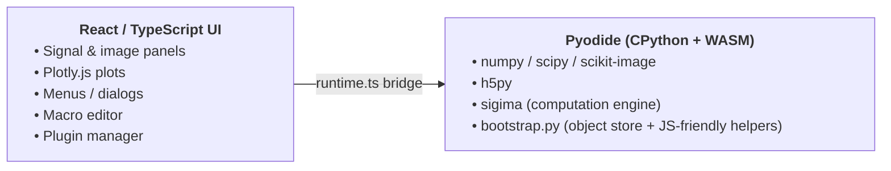

# DataLab Web

Full-Web reimplementation of the [DataLab](https://datalab-platform.com/) scientific data-processing platform — the entire computation engine and processing catalog run **inside the browser**.

DataLab Web embeds the [Sigima](https://github.com/DataLab-Platform/Sigima) computation engine in [Pyodide](https://pyodide.org/) (CPython compiled to WebAssembly, JupyterLite-style) and pairs it with a dedicated React / TypeScript user interface modelled on the desktop Qt DataLab application. Plotting is delegated to [Plotly.js](https://plotly.com/javascript/) since Qt-based PlotPy is not available in the browser.

## 🚀 Try it now — no install required

**👉 <https://datalab-platform.com/web/>**

The latest release is deployed automatically to GitHub Pages. Open the link in any modern browser (Chrome, Edge, Firefox, Safari) and the full DataLab application — Sigima, NumPy, SciPy, scikit-image, h5py — runs locally inside the browser tab. No server, no account, no upload: your data never leaves your machine.

> First load downloads Pyodide and installs Sigima via `micropip` (~30–60 s). Subsequent loads are cached by the browser. On Microsoft Edge the first load may be much slower — see [doc/troubleshooting.md](doc/troubleshooting.md) for the one-line fix.


## Features

DataLab Web mirrors a large portion of the desktop application surface:

- **Signal & image panels** — 1D curves and 2D arrays with a rich set of synthetic generators, full Plotly visualisation, cross-hair markers, contrast adjustment, cross profiles and stats area tools.
- **Processing & analysis** — operations, transforms, filters, fitting, FFT/PSD, stability analyses, measurements and profile extraction, exposed automatically through the menu bar by introspecting Sigima's catalog.
- **ROI & object tree** — segment / rectangular / circular / polygonal regions of interest, plus a multi-group workspace with drag & drop, metadata editor, statistics card and computation history.
- **Macros & notebooks** — embedded Python editor and multi-tab notebook panel, each running in dedicated Web Workers, with `.ipynb` import/export and bidirectional macro ⇄ notebook conversion. See [doc/notebooks.md](doc/notebooks.md).
- **Plugins** — Qt-compatible `PluginBase` API: the same plugin source runs in DataLab desktop and DataLab Web. See [doc/plugins.md](doc/plugins.md).
- **I/O** — HDF5 browser (via `h5py` in Pyodide), text import wizard and per-directory save dialog.
- **UI niceties** — light / dark theme, persisted layout, pop-out result panel, contextual help, full [internationalisation](doc/i18n.md).

## Architecture overview



For the full picture — layer view, component view, worker protocols, the source-tree breakdown and end-to-end flows with diagrams — see [doc/architecture.md](doc/architecture.md). The [persistence model](doc/persistence.md) explains why the HDF5 workspace file is the single durable source of truth.

## Comparison with related projects

| Project         | Purpose                                             | Runs where      |
| --------------- | --------------------------------------------------- | --------------- |
| DataLab         | Reference desktop app (Qt + PlotPy)                 | Native          |
| DataLab-Kernel  | Jupyter kernel exposing DataLab to notebooks        | Local Python    |
| **DataLab-Web** | **Full browser app, Sigima in WASM (this project)** | **Browser**     |
| Sigima          | Headless computation engine (signals/images)        | Anywhere Python |

## Development

Prerequisites: Node.js ≥ 18.

```powershell
npm install
npm run dev      # Vite dev server on http://localhost:5173
npm run build    # static bundle in dist/ (deployable to any static host)
npm run lint     # ESLint
npm run format   # Prettier
```

The first dev load downloads Pyodide (~10 MB) and installs Sigima via `micropip` (30–60 s); subsequent loads are cached. Vite is configured with `base: "./"` so the build works under sub-paths.

## Documentation

| Topic                                              | Guide                                              |
| -------------------------------------------------- | -------------------------------------------------- |
| Documentation index                                | [doc/README.md](doc/README.md)                     |
| Architecture (layers, workers, flows, source tree) | [doc/architecture.md](doc/architecture.md)         |
| Persistence model                                  | [doc/persistence.md](doc/persistence.md)           |
| Notebooks                                          | [doc/notebooks.md](doc/notebooks.md)               |
| Plugins                                            | [doc/plugins.md](doc/plugins.md)                   |
| Internationalisation                               | [doc/i18n.md](doc/i18n.md)                         |
| Testing strategy & running the suites              | [doc/testing-strategy.md](doc/testing-strategy.md) |
| Releasing & distribution (app + SDK tarballs)      | [doc/releasing.md](doc/releasing.md)               |
| Troubleshooting                                    | [doc/troubleshooting.md](doc/troubleshooting.md)   |
| Roadmap                                            | [doc/roadmap.md](doc/roadmap.md)                   |

## Use of Generative AI

DataLab-Web is funded under an [NLnet](https://nlnet.nl/) grant and complies with the [NLnet policy on the use of Generative AI](https://nlnet.nl/foundation/policies/generativeAI/). GenAI is used as a development aid only; high-level review, architectural decisions and scientific validation remain under exclusive human responsibility, and AI-assisted commits carry an `Assisted-by: <Model> <Version>` trailer. The full rules live in [CONTRIBUTING.md](CONTRIBUTING.md).

## License

BSD 3-Clause, same as DataLab and Sigima.
