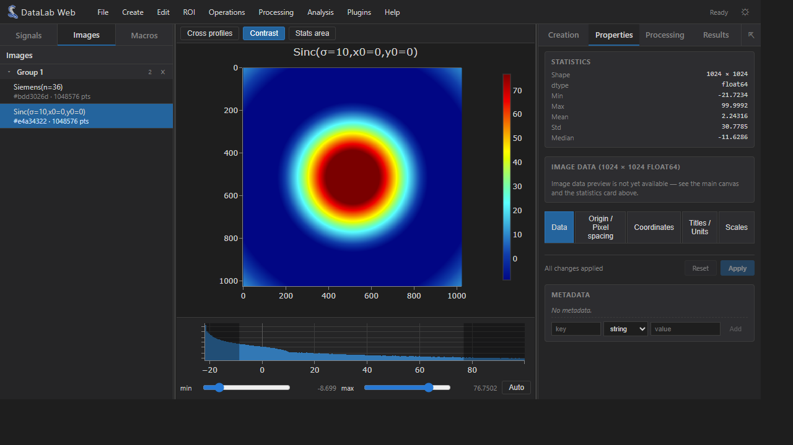

# DataLab Web

Full-Web reimplementation of the [DataLab](https://datalab-platform.com/)
scientific data-processing platform — the entire computation engine and
processing catalog run **inside the browser**.

DataLab Web embeds the [Sigima](https://github.com/DataLab-Platform/Sigima)
computation engine in [Pyodide](https://pyodide.org/) (CPython compiled to
WebAssembly, JupyterLite-style) and pairs it with a dedicated React /
TypeScript user interface modelled on the desktop Qt DataLab application.
Plotting is delegated to [Plotly.js](https://plotly.com/javascript/) since
Qt-based PlotPy is not available in the browser.



## Features

DataLab Web mirrors a large portion of the desktop application surface:

- **Signal panel** — 1D curves with synthetic generators (Gaussian,
  Lorentzian, Voigt, Planck blackbody, sine, sawtooth, triangle, square,
  sinc, chirp, step, exponential, logistic, pulses, polynomial, custom
  expressions, noise distributions…) and full Plotly visualisation with
  cross-hair markers and annotations.
- **Image panel** — 2D arrays with synthetic generators (2D Gaussian,
  ramp, checkerboard, sinusoidal grating, ring pattern, Siemens star,
  2D sinc, uniform / normal / Poisson noise…), zoomable Plotly heatmap,
  contrast adjustment, cross profiles and stats area tools.
- **Processing** — operations, transforms, filters, fitting, FFT/PSD,
  stability analyses and many other Sigima 1-to-1 / 2-to-1 / n-to-1
  processings, exposed automatically through the menu bar by
  introspecting Sigima's catalog.
- **Analysis** — measurements producing scalar results and result tables;
  interactive fit dialog; profile extraction (line / segment / average /
  radial) with graphical parameter editing.
- **ROI management** — segment / rectangular / circular / polygonal
  regions of interest with a dedicated editor and grid view.
- **Object tree** — multi-group workspace with drag & drop, properties,
  metadata editor, statistics card and computation history.
- **Macros** — embedded Python editor (CodeMirror with autocompletion and
  search) plus a console, mirroring DataLab's macro system. Macros call
  the same `proxy` API as the desktop.
- **Plugins** — Qt-compatible `PluginBase` API. The same plugin source
  runs in DataLab desktop and DataLab Web provided dialogs use
  `await param.edit_async(...)`. See [doc/plugins.md](doc/plugins.md).
- **I/O** — HDF5 browser (via `h5py` running in Pyodide), text import
  wizard and per-directory save dialog.
- **UI niceties** — light / dark theme, resizable splitters with
  persisted layout, pop-out result panel, contextual help dialog.

## Architecture overview

```
 ┌─────────────────────────── Browser ───────────────────────────┐
 │  React / TypeScript UI   ──►   Pyodide (CPython + WASM)        │
 │   • Signal & image panels    • numpy / scipy / scikit-image    │
 │   • Plotly.js plots          • h5py                            │
 │   • Menus / dialogs          • sigima (computation engine)     │
 │   • Macro editor             • bootstrap.py (object store +    │
 │   • Plugin manager             JS-friendly helper functions)   │
 └────────────────────────────────────────────────────────────────┘
```

Code organisation:

- `src/sigima/` — Pyodide loader and Python ↔ JS bridge.
  - `bootstrap.py` — Python module loaded into Pyodide; owns the in-memory
    object model and exposes the helper functions the UI calls.
  - `runtime.ts` — typed wrapper around the Pyodide instance.
  - `SigimaContext.tsx` — React context that loads the runtime once.
- `src/components/` — UI building blocks (menu bar, object tree, plots,
  dialogs, macro panel, side panels…).
- `src/actions/` — action registry that maps Sigima features to menu items.
- `src/plugins/` — host-side support for the Qt-compatible plugin API.
- `src/macros/` — macro editor and execution helpers.
- `src/App.tsx` — top-level layout (menu bar at the top, object tree on
  the left, central plot area, results panel on the right).

## Comparison with related projects

| Project        | Purpose                                              | Runs where      |
| -------------- | ---------------------------------------------------- | --------------- |
| DataLab        | Reference desktop app (Qt + PlotPy)                  | Native          |
| DataLab-Kernel | Jupyter kernel exposing DataLab to notebooks         | Local Python    |
| **DataLab-Web**| **Full browser app, Sigima in WASM (this project)**  | **Browser**     |
| Sigima         | Headless computation engine (signals/images)         | Anywhere Python |

## Development

Prerequisites: Node.js ≥ 18.

```powershell
npm install
npm run dev
```

Open http://localhost:5173. The first load downloads Pyodide (~10 MB)
and installs Sigima via `micropip`, which can take 30–60 seconds.
Subsequent loads are cached by the browser.

### Build a static deployment

```powershell
npm run build
```

The `dist/` folder can be served from any static host (GitHub Pages, S3,
nginx, …). Vite is configured with `base: "./"` so all paths are relative
and the app works under sub-paths.

### Useful scripts

```powershell
npm run lint     # ESLint
npm run format   # Prettier
npm run preview  # Serve the production build locally
```

## Plugins

DataLab-Web ships a Qt-compatible plugin system. The same `PluginBase`
subclass can run unchanged in DataLab desktop and DataLab-Web, provided
parameter dialogs use `await param.edit_async(self.main)` instead of the
synchronous `param.edit(self.main)`. See [doc/plugins.md](doc/plugins.md)
for details, hot-reload behaviour and the bundled vitrine plugin.

## Roadmap

Short-term:

- Generic results-table view aligned with the desktop *Results* panel.
- Richer image data preview (numeric grid with virtualised scrolling).
- Off-main-thread Pyodide via Web Worker to keep the UI responsive on
  long-running computations.
- Additional file formats through `sigima.io` (currently focused on text
  and HDF5).

Longer-term:

- Remote control bridge to a real DataLab desktop instance via the Web API.
- Collaborative sessions through shared workspace files.

## License

BSD 3-Clause, same as DataLab and Sigima.
