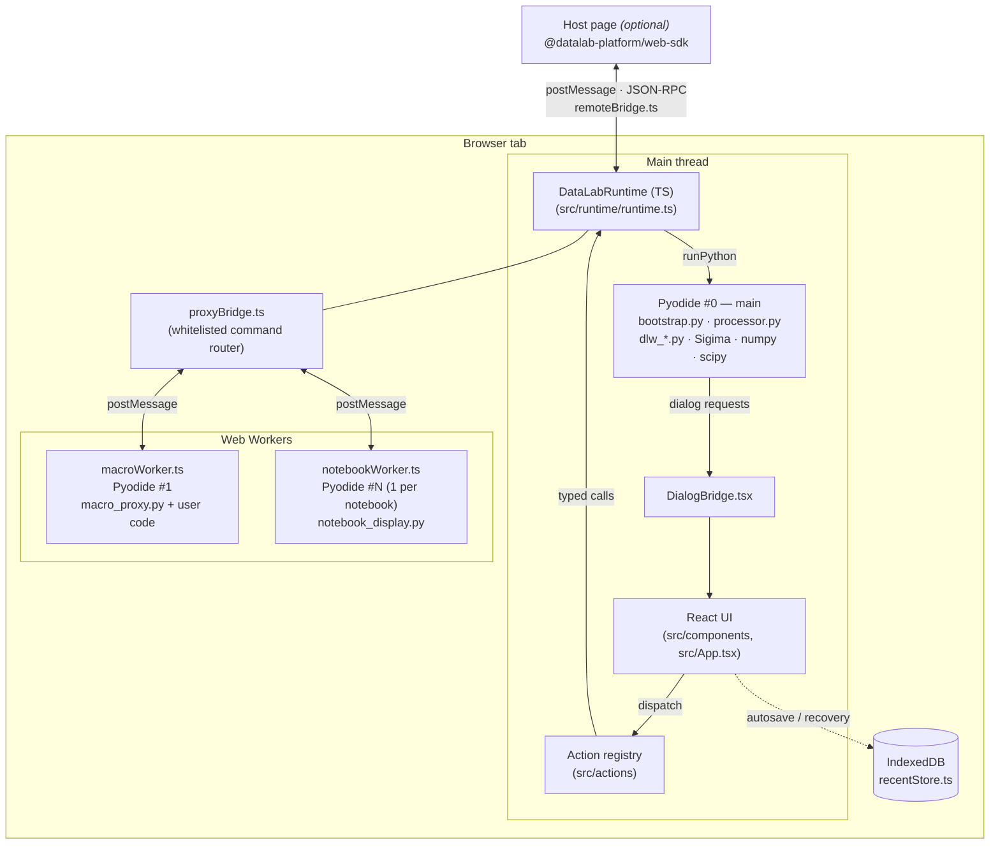
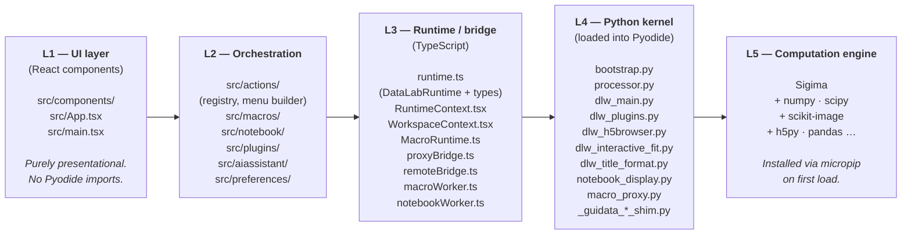
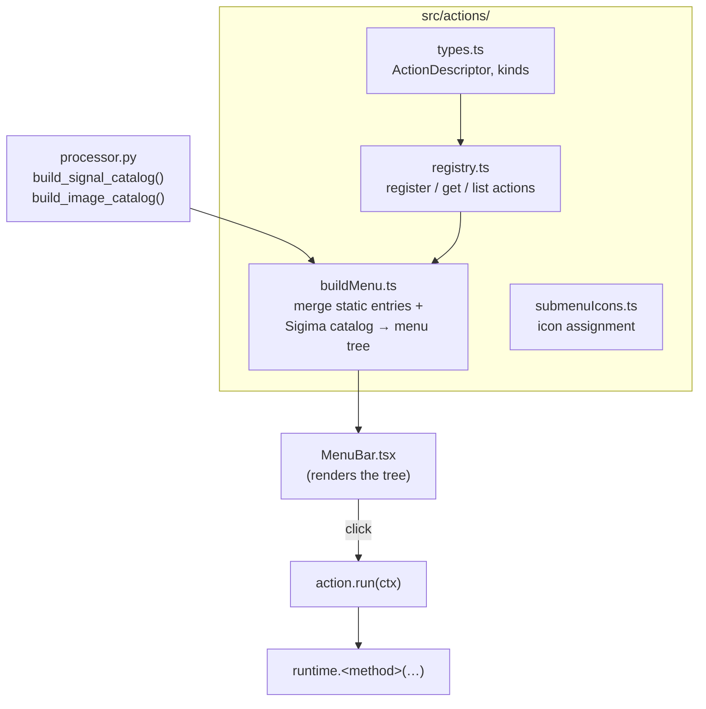
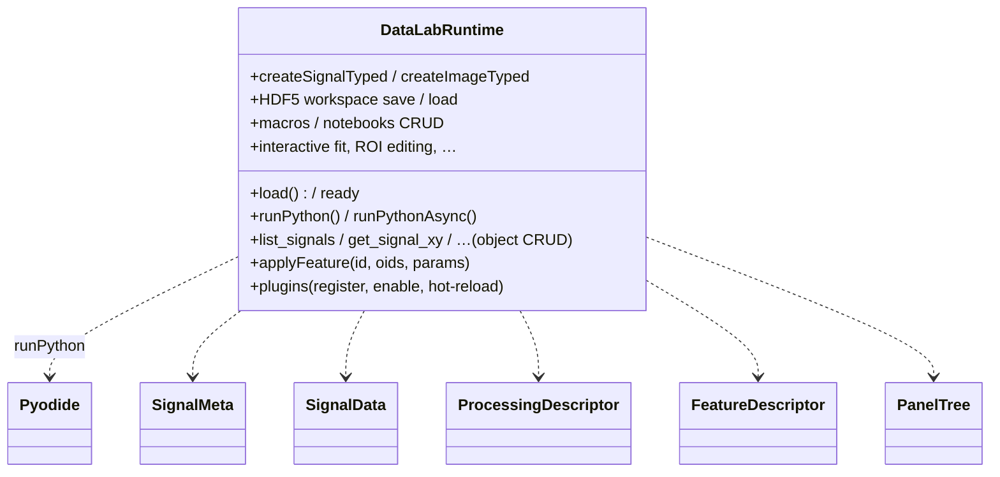
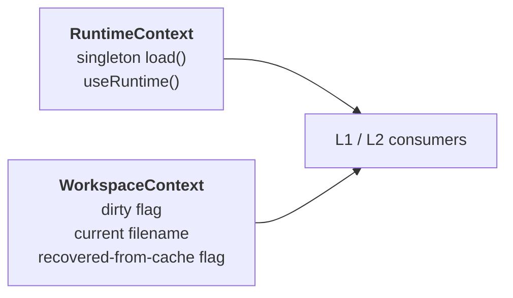
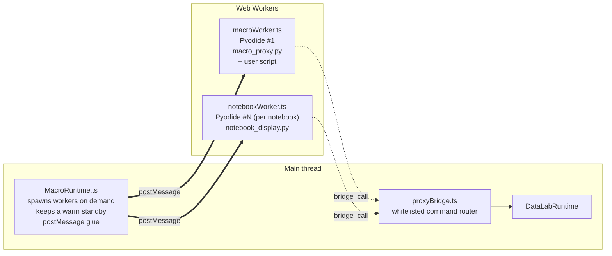
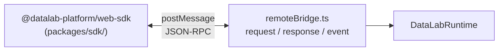

# DataLab-Web — Architecture

> Status: living document. Mirrors the source tree as of the time of
> writing. When you add a new top-level subsystem, update the diagrams
> below in the same commit.

DataLab-Web is the **browser-native** sibling of the DataLab desktop
application. It runs the [Sigima](https://github.com/DataLab-Platform/Sigima)
computation engine inside [Pyodide](https://pyodide.org/) (CPython compiled
to WebAssembly) and renders a dedicated React + TypeScript UI inspired by
the desktop Qt application. Plotting is delegated to
[Plotly.js](https://plotly.com/javascript/) — PlotPy (Qt) is not available
in the browser.

The whole stack runs **inside a single browser tab**: there is no backend.
The HDF5 workspace file is the only durable artifact (see
[Persistence model](../README.md#persistence-model)).

---

## 1. General architecture



Key facts:

- **One Pyodide instance owns the object model** (`_MODEL` in
  `bootstrap.py`). All UI reads go through it.
- **Each macro / notebook runs in its own Web Worker** with its own
  Pyodide instance. Workers never touch the main object model directly:
  they call back to the main runtime through `proxyBridge`.
- **The host page (optional)** controls an embedded DataLab-Web through
  the same RPC vocabulary, but transported by `remoteBridge` over
  `window.postMessage`.

---

## 2. Layer view

Five layers, left to right — each layer only depends on the ones to its
right.



### Inter-layer contracts

| Boundary    | Contract                                                                           |
| ----------- | ---------------------------------------------------------------------------------- |
| L1 → L2     | `useAction(id)` / event handlers; no direct runtime calls from components.         |
| L2 → L3     | Typed methods on `DataLabRuntime` (`useRuntime()`).                                |
| L3 → L4     | `pyodide.runPython()` / `pyodide.runPythonAsync()` calling `bootstrap.py` helpers. |
| L3 ↔ Worker | `postMessage` (`bridge_call` / `bridge_reply` / `stdout` / `stderr` / …).          |
| L3 ↔ Host   | `postMessage` JSON-RPC (`request` / `response` / `event`) via `remoteBridge`.      |
| L4 → L5     | Python imports (`sigima.proc`, `sigima.objects`, …). Catalog is auto-discovered.   |

### Hard invariants

- Components **must not** import from `src/runtime/runtime.ts` directly;
  they consume `useRuntime()` and dispatch through `src/actions/`.
- Python helpers return **JSON-friendly dicts / lists** (`tolist()` on
  arrays), never live PyProxies, to keep the bridge cheap.
- The pinned `PYODIDE_VERSION` in `runtime.ts` and the `<script>` tag in
  `index.html` must always match — the wheel index is version-specific.

---

## 3. Component view

### 3.1 UI layer — `src/components/`

Presentational React. Notable components:

- `MenuBar.tsx` / `MenuDropdown.tsx` — top menu bar built from the action
  registry.
- `ObjectTree.tsx`, `TreeKindSwitcher.tsx`, `SidePanel.tsx` — left panel:
  hierarchical workspace (groups, signals, images) + properties /
  metadata / stats / history.
- `SignalPlot.tsx`, `ImagePlot.tsx`, `MultiImagePlot.tsx`,
  `CentralViewSwitcher.tsx` — Plotly-based central plot area.
- `DataSetDialog.tsx` + `DataSetForm/` — **auto-generated parameter
  dialogs** from guidata DataSet JSON schemas (do not hand-write a form
  unless the auto path genuinely cannot express it).
- `DialogBridge.tsx` — single React entry-point that **receives dialog
  requests from Python** via `bootstrap.set_dialog_bridge()` and routes
  them to the appropriate React dialog component.
- ROI: `RoiDialog.tsx`, `ImageRoiDialog.tsx`, `RoiGridDialog.tsx`,
  `signalRoi.ts`, `imageRoi.ts`.
- Other domain dialogs: `H5BrowserDialog.tsx`, `InteractiveFitDialog.tsx`,
  `TextImportWizard.tsx`, `MetadataDialog.tsx`,
  `ProfileDefinitionDialog.tsx`, `SaveToDirectoryDialog.tsx`,
  `SeparateViewDialog.tsx`, `PluginManagerDialog.tsx`,
  `PluginConsentDialog.tsx`, `HelpDialog.tsx`.
- Macros / notebooks: `MacroPanel.tsx`, `MacroEditorTabs.tsx`,
  `MacroConsole.tsx`, `notebook/`.
- AI assistant: `AIAssistant/`.

### 3.2 Orchestration — `src/actions/`



Most processings are **not** hand-registered: `buildMenu.ts` queries
`processor.py` (`build_signal_catalog`, `build_image_catalog`) and
synthesises menu entries automatically. The static registry only adds
DataLab-Web-specific commands (file IO, ROI editor, plugin manager,
notebooks, macros, …).

### 3.3 Runtime / bridge — `src/runtime/`

#### `DataLabRuntime` (`runtime.ts`)

Single class that owns the **main-thread Pyodide instance** and exposes a
typed surface to the rest of the app:



Companion exports (interfaces / types): `SignalMeta`, `SignalStyle`,
`SignalData`, `ProcessingDescriptor`, `LastProcessingInfo`, `Pattern`,
`FeatureDescriptor`, `InteractiveFitInfo` / `Param` / `Init` / `Auto`,
`PluginInfoMeta`, `PluginRecord`, `PluginMenuAction`, `PanelKind`,
`ObjectNode`, `GroupNode`, `PanelTree`, `ObjectMeta`, plus thin
`PyodideAPI` / `PyProxy` aliases.

#### React contexts



`RuntimeContext` guarantees Pyodide is loaded exactly once, even across
HMR reloads (the Python `_MODEL` and `_CATALOG` survive re-execution of
`bootstrap.py`).

#### Worker subsystem



Wire shape (same for both worker kinds):

| Direction     | Message types                                                          |
| ------------- | ---------------------------------------------------------------------- |
| main → worker | `init` · `run` · `bridge_reply`                                        |
| worker → main | `ready` · `started` · `finished` · `stdout` · `stderr` · `bridge_call` |

`proxyBridge.ts` is a **whitelisted command router**: it maps the
`method` string in a `bridge_call` to a specific main-thread runtime
call. Workers cannot invoke arbitrary methods — only the ones explicitly
listed (add_signal, add_image, list/get/delete object, add/set object
from pickle, add_group, get/set selection, etc.).

#### Remote control bridge



### 3.4 Python kernel — `src/runtime/*.py`

Modules pushed into Pyodide's virtual FS at load time. They are written
to be re-executable so HMR keeps `_MODEL` / `_CATALOG` alive.

- **`bootstrap.py`** — the kernel. Owns `_MODEL` (the hierarchical object
  store: panels → groups → objects), the dialog bridge, HDF5
  serialisation, macro / notebook records, and ~150 helper functions
  consumed by `DataLabRuntime`. Logical groups:
  - **Object CRUD**: `add_object_pickled`, `set_object_pickled`,
    `duplicate_object`, `delete_object`, `move_object[s]`,
    `rename_object`, `add_signal_from_arrays`, `add_image_from_array`.
  - **Tree / groups**: `get_panel_tree`, `create_group`, `rename_group`,
    `delete_group`, `get_group_titles_with_object_info`,
    `resolve_group_oids`.
  - **Signals & images access**: `get_signal_xy`, `get_signals_xy`,
    `set_signal_style`, `get_object_stats`, `get_object_property_schema`,
    `set_object_property_values`, metadata helpers.
  - **Typed generators**: `list_signal_creation_types`,
    `create_signal_typed`, `update_signal_creation_params`, idem image.
  - **IO**: `list_signal_io_formats`, `open_signal_from_bytes`,
    `save_signal_to_bytes`, idem image. HDF5 workspace serialisation.
  - **Macros / notebooks**: full CRUD + reorder + replace (used by the
    in-browser recovery cache when restoring from IndexedDB).
  - **Dialog bridge**: `set_dialog_bridge(bridge)` registers the JS
    callable used by Python helpers that need to ask the user something.

- **`processor.py`** (loaded as `dlw_processor.py`) — introspects
  Sigima's catalog and exposes `build_signal_catalog()`,
  `build_image_catalog()` and the `apply_*` dispatchers. Equivalent of
  desktop DataLab's `register_1_to_1` / `register_n_to_1` /
  `register_2_to_1`. Override hooks allow renaming / hiding / regrouping
  entries or wiring custom result renderers.

- **`dlw_main.py`** — exposes a `datalab.*` namespace inside Pyodide
  (panels, current panel, etc.) so that **DataLab desktop plugins run
  unchanged** in the browser, provided they use `await
param.edit_async(...)` for parameter dialogs.

- **`dlw_plugins.py`** — host for the Qt-compatible plugin API:
  discovery, registration, hot-reload, consent dialog, menu wiring.

- **`dlw_h5browser.py`** — HDF5 browser backend (consumed by
  `H5BrowserDialog.tsx`).

- **`dlw_interactive_fit.py`** — interactive-fit backend (consumed by
  `InteractiveFitDialog.tsx`).

- **`dlw_title_format.py`** — central title formatting for computed
  results (mirrors Sigima's title strategy).

- **`notebook_display.py`** — implements Jupyter-like `display()` and
  cell execution semantics inside the notebook worker.

- **`macro_proxy.py`** — defines the **async `proxy` object** exposed to
  user scripts (macros and notebook cells). Each method ultimately
  becomes a `bridge_call` to the main thread.

- **`_guidata_backends_shim.py`** / **`_guidata_jsonschema_shim.py`** —
  patch guidata so that DataSet parameter classes (a) do not require a
  Qt backend and (b) can be serialised as JSON schemas that
  `DataSetDialog.tsx` consumes.

### 3.5 SDK — `packages/sdk/`

Shipped as a **separate tarball** (`@datalab-platform/web-sdk`). Provides
typed TypeScript clients for host pages embedding DataLab-Web in an
iframe. Talks to `remoteBridge.ts` over the wire protocol described
above. Its `package.json` version must stay aligned with the app's.

### 3.6 Persistence — `src/storage/`

- `recentStore.ts` — IndexedDB-backed cache for the recent-files menu and
  for crash recovery. **Not durable in the project sense**: the HDF5
  workspace file is the single source of truth.

---

## 4. Wire protocols

### 4.1 Worker ↔ main (proxyBridge)

Implemented in `macroWorker.ts` / `notebookWorker.ts` ↔ `proxyBridge.ts`.

```text
main → worker
  { type: "init" }
  { type: "run", code: string, name?: string }
  { type: "bridge_reply", id: string, ok: boolean, value?: any, error?: string }

worker → main
  { type: "ready" }
  { type: "started", name: string }
  { type: "finished", ok: boolean, error?: string }
  { type: "stdout" | "stderr", text: string }
  { type: "bridge_call", id: string, method: string, payload: any }
```

`method` is matched against an **explicit allow-list** in
`proxyBridge.ts`; unknown methods produce an error reply.

### 4.2 Iframe ↔ host (remoteBridge)

Small JSON-RPC dialect, versioned (`RPC_PROTOCOL_VERSION`).

```text
host → iframe       { id, type: "request",  method, params? }
iframe → host       { id, type: "response", result? | error? }
iframe → host       {     type: "event",    name, payload?   }
```

Synthetic method `get_protocol_version` lets clients negotiate
compatibility independently of the application version.

---

## 5. End-to-end flows

### 5.1 Applying a processing

```text
1. User clicks  Processing › <feature>     in MenuBar
2. action.run(ctx)  (from src/actions/registry.ts)
3. If params needed → DataSetDialog (auto-generated from JSON schema)
4. runtime.applyFeature(featureId, selectedOids, paramValues)
5. pyodide.runPython → processor.apply_*(feature, oids, params)
6. Sigima computes; new SignalObj/ImageObj added to _MODEL
7. bootstrap returns new oids; UI refreshes ObjectTree + plots
8. WorkspaceContext is marked dirty
```

### 5.2 Running a macro

```text
1. User clicks  Run  in MacroPanel
2. MacroRuntime spawns / reuses a macroWorker
3. main → worker: { type: "run", code, name }
4. worker executes user code; calls `await proxy.<method>(…)`
5. macro_proxy.py emits  { type: "bridge_call", … }
6. proxyBridge dispatches to a whitelisted DataLabRuntime call
7. main → worker: { type: "bridge_reply", … }
8. stdout / stderr stream back to MacroConsole
9. worker → main: { type: "finished", ok, error? }
```

### 5.3 Remote control from a host page

```text
1. Host imports @datalab-platform/web-sdk and embeds the iframe
2. Host calls  client.addSignal(x, y, title)
3. SDK posts   { id, type: "request", method: "add_signal", params }
4. remoteBridge.ts dispatches to DataLabRuntime (same allow-list spirit)
5. iframe posts  { id, type: "response", result }
6. Model changes also surface as  { type: "event", name, payload }
```

---

## 6. Testing layers

The architecture is mirrored by three test layers — see
[doc/testing-strategy.md](testing-strategy.md) for the full decision
tree.

| Layer      | Tool                | Scope                                            |
| ---------- | ------------------- | ------------------------------------------------ |
| Python     | pytest (in Pyodide) | `bootstrap.py`, `processor.py`, dlw\_\*.py logic |
| TS unit    | Vitest + RTL        | runtime types, action registry, components       |
| End-to-end | Playwright          | full UI through real Pyodide round-trips         |

---

## 7. Conventions recap

- **Type-safety end-to-end**: never widen a Pyodide return value beyond
  its declared TS type. Add new fields in the Python helper _and_ the TS
  interface in the same commit.
- **No business logic in components**: orchestration lives in
  `src/actions/` and the runtime.
- **JSON across the bridge**: prefer plain dicts/lists in Python over
  passing PyProxies.
- **`base: "./"`** in Vite config — the build is drop-in deployable to
  GitHub Pages and other sub-path hosts. Do not introduce absolute URLs.
- **Pinned Pyodide**: `PYODIDE_VERSION` in `runtime.ts` and the
  `<script>` tag in `index.html` must always be bumped together.
